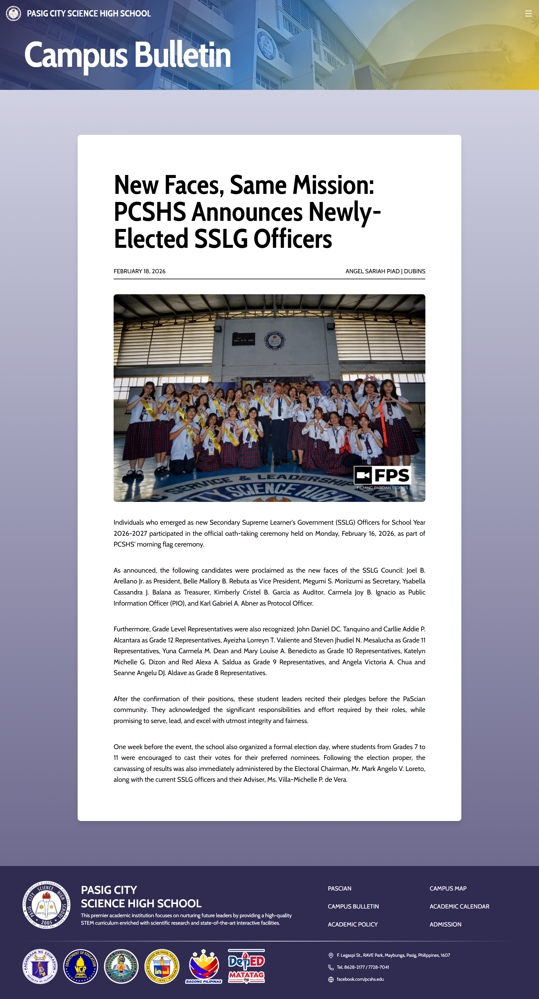
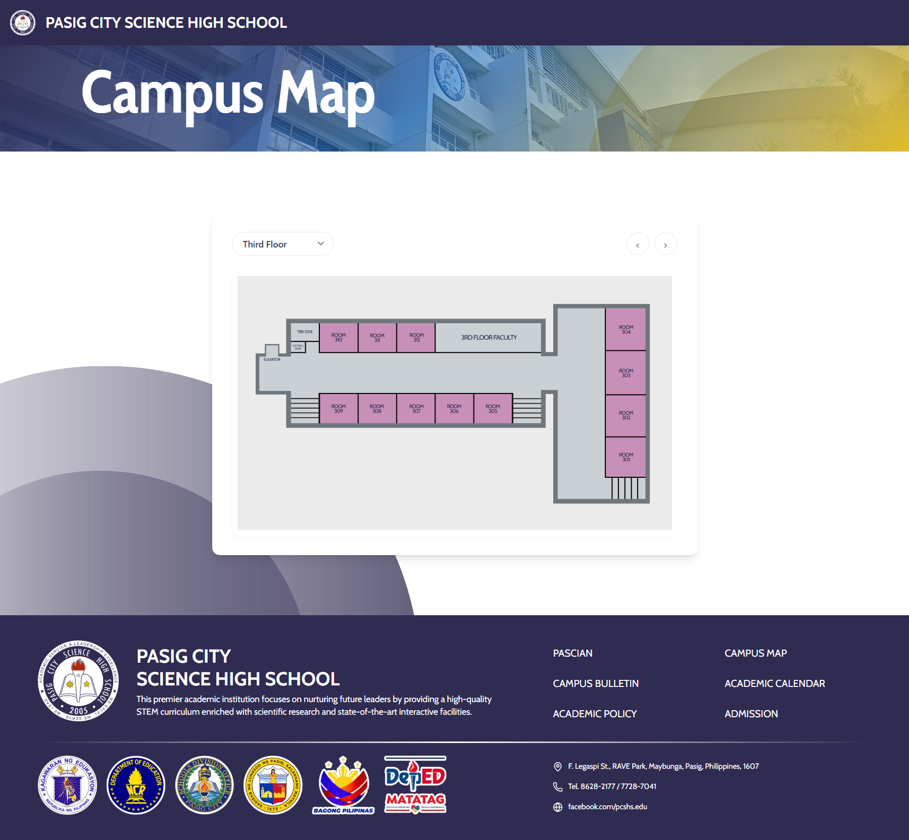
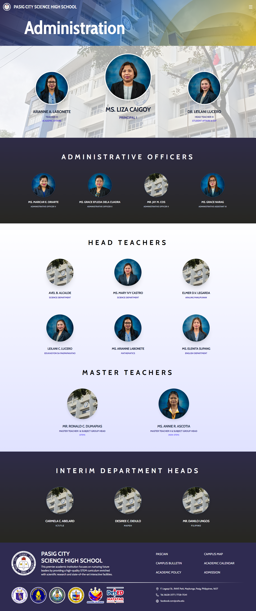
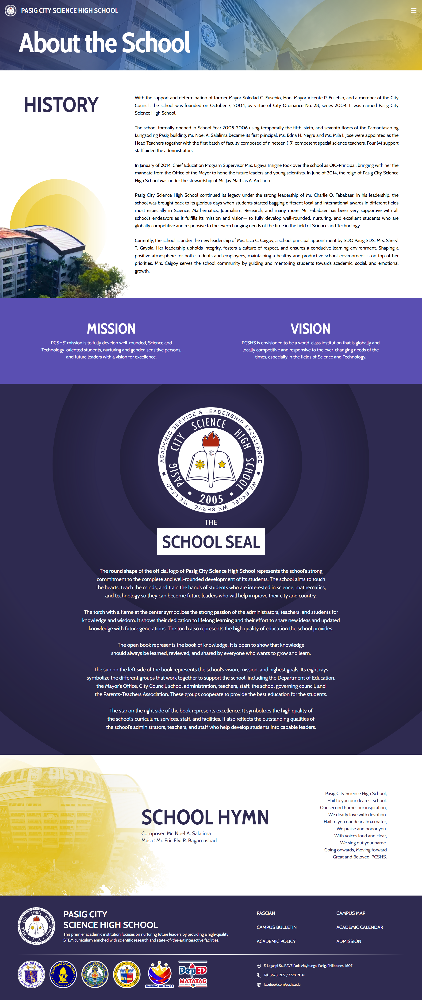
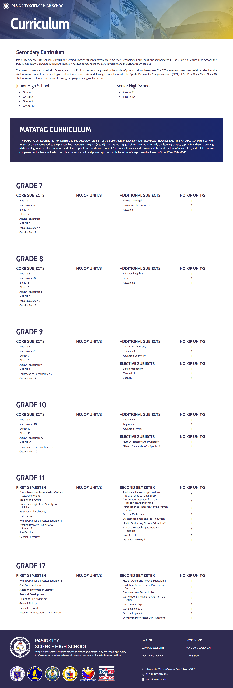
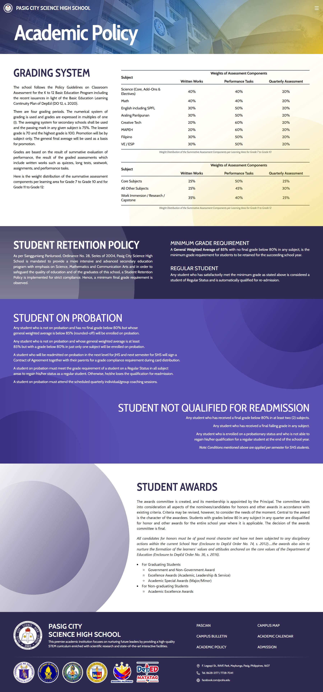
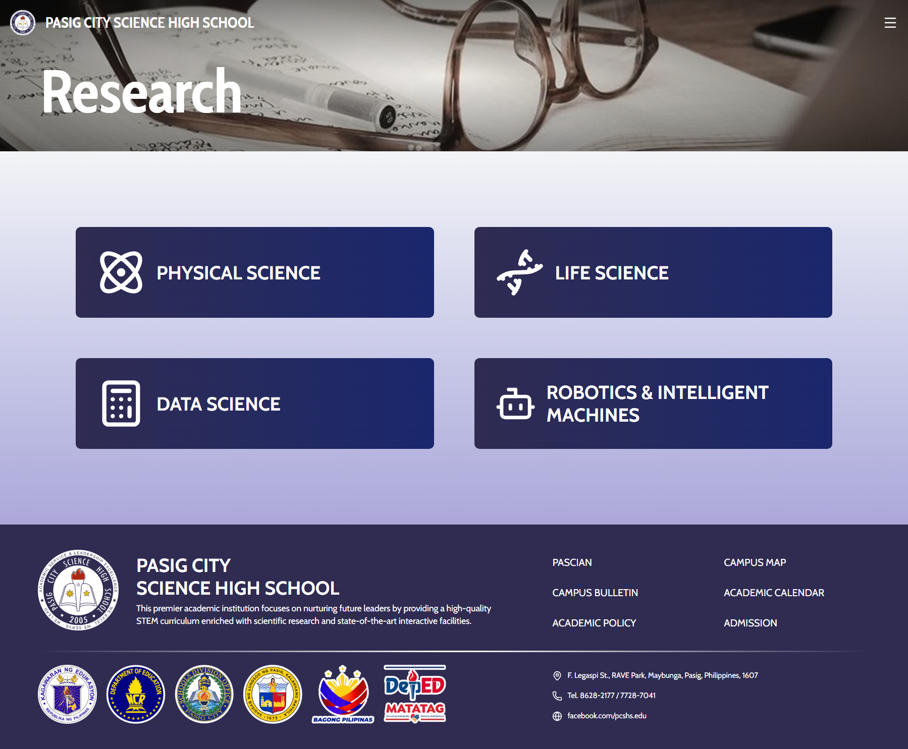

# Pasig City Science High School

 [](https://badges.strrl.dev)

This is the official repository of the Pasig City Science High School (PCSHS) website made by the students of Grade 12 - Dubins (Batch 16)! Note that this repository is still a work in progress and may contain some bugs. If you have any suggestions or feedback, please feel free to open an issue or submit a pull request.

## Replication

To replicate this website, you can follow these steps:

1. Clone this repository to your local machine by downloading the ZIP file or through Git.
2. Once unzipped or cloned into your local directory, run the following commands:

    ```bash
    npm i
    npm run dev
    ```

3. Open your browser and navigate to `http://localhost:5173` to view the website in development mode.

## Contributing

If you would like to contribute to this project, please follow these guidelines:

1. Fork the repository and create a new branch for your feature or bug fix.
2. Make your changes and commit them with clear and descriptive messages.
3. Push your changes to your forked repository and open a pull request to the main repository.
4. Ensure that your code follows the existing style and conventions of the project.

## Current Contributors

|   **Development**  | **Design and Layout** |   **Content**  |   **Proofreading**  |
|:------------------:|:---------------------:|:--------------:|:-------------------:|
| Miguel Villegas    | Jervy Pascual         | Angel Piad     | Sophia Santiago     |
| James Tortilla     | Leiu Gavina           | Mary Barcelona |                     |
| Xavier Pariñas     | Thomas Tupas          | Wynona Ventura |                     |
| Sebastian Anonical | Shannon Balaos        | Elaira Cruz    |                     |
| Miko Marcelo       | Venice Victorino      | LJ Guarte      |                     |
| Lhanze Lachica     | Chanelle Ramos        | Abiezer Intad  |                     |
| Kirk Cabotaje      | Araziel Salas         | Alyson Sison   |                     |
| Hector Robledo     | Daphne Amado          | Queensy Bien   |                     |
|                    | Hayah Reyes           | Bhea Labro     |                     |
|                    | Gracia Bautista       | Althea Basal   |                     |
|                    | Charisse Manalo       | Moana Factor   |                     |
|                    |                       | Nicole Narag   |                     |
|                    |                       | Paula Goboy    |                     |
|                    |                       | Treanne Zamora |                     |
|                    |                       | Deniza Lajara  |                     |
|                    |                       | Russell Salen  |                     |

## Sample Pages

### Homepage


### News Page Sample



### Campus Map



### Administration



### School Information



### Curriculum



### Academic Policy



### Research


